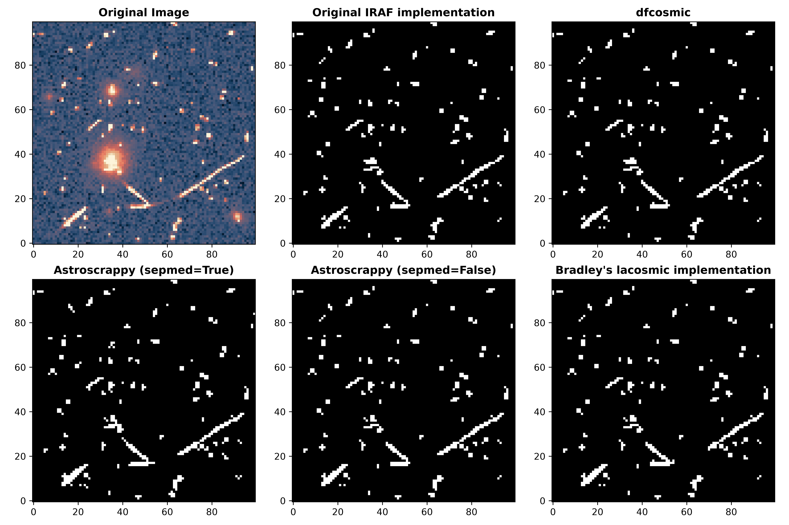
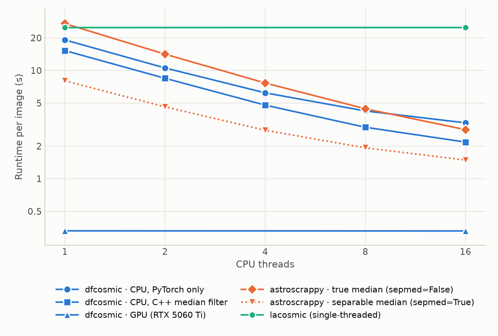

# dfcosmic

[](https://github.com/DragonflyTelescope/dfcosmic/actions/workflows/test.yml) 
[](https://dfcosmic.readthedocs.io/en/latest/?badge=latest)
[](https://doi.org/10.5281/zenodo.18451350)


A high-performance Python package for cosmic ray removal strictly following the procedure outlined in [van Dokkum 2001](https://ui.adsabs.harvard.edu/abs/2001PASP..113.1420V/abstract). Although several other implementations exist, their procedures differ slightly from that described in van Dokkum 2001. In this package, we use [PyTorch](https://pytorch.org/) to achieve considerable speedup over the original implementation while retaining fidelity to the algorithmic choices presented in the original paper.

## Installation

### Using PyPi

If you want to install using PyPi (which is certainly the easiest way), you can simply run

```bash
pip install dfcosmic
```

### Installing from Source

For the latest development version, install directly from the GitHub repository:

```bash
git clone https://github.com/DragonflyTelescope/dfcosmic.git
cd dfcosmic
pip install -e .
```

Both of these give you a pure-Python install that runs entirely on PyTorch (CPU or GPU). The plots in the demo notebooks need a few extra packages, which you can get with `pip install "dfcosmic[notebooks]"`.

For development installation with documentation dependencies:

```bash
pip install -e ".[docs]"
```

### Optional: C++ median filter for the CPU

On the CPU, most of the runtime is spent in the median filter. `dfcosmic` includes an optional C++/OpenMP median filter that gives identical results to the PyTorch one but is faster. It is **not** part of the PyPI wheel and is **not** built by a plain `pip install`, because it has to be compiled against the PyTorch version you have installed. To build it you need a C++ compiler with OpenMP support and PyTorch installed *before* building. On macOS the Xcode command line tools are enough: the extension links against the OpenMP runtime bundled with the PyTorch wheel, so do not point the build at a separate `libomp` (e.g. Homebrew's) via `LDFLAGS` — two OpenMP runtimes in one process will crash.

```bash
pip install torch "setuptools>=77"
git clone https://github.com/DragonflyTelescope/dfcosmic.git
cd dfcosmic
DFCOSMIC_BUILD_CPP=1 pip install --no-build-isolation -e .
```

`--no-build-isolation` is what makes your installed PyTorch visible to the build; `DFCOSMIC_BUILD_CPP=1` turns a missing PyTorch into an error rather than silently skipping the extension. You can check that it worked with

```bash
python -c "from dfcosmic.utils import cpp_median_available; print(cpp_median_available())"
```

Once built, the extension is used automatically when `device="cpu"`. A few things to keep in mind:

- The extension is tied to the PyTorch version it was built against. After upgrading PyTorch, rebuild it by re-running the `pip install` command above.
- If the extension is not available, `dfcosmic` uses the PyTorch median filter. Passing `use_cpp=True` explicitly will warn you (once per session) when that happens; `use_cpp=False` always uses the PyTorch median filter.
- If you want CPU-specific optimizations, you can pass extra compiler flags, e.g. `CXXFLAGS="-march=native"`. The resulting binary will then only run on similar CPUs.
- Setting the environment variable `DFCOSMIC_DISABLE_CPP=1` at runtime disables the extension.

## Basic Usage
We follow the same parameter naming conventions presented in the original IRAF code.

- `objlim`: The contrast limit between CR and underlying objects
- `sigfrac`: The fractional detection limit for neighboring pixels
- `sigclip`: The detection limit for cosmic rays

```python
from dfcosmic import lacosmic

clean_image, crmask = lacosmic(
    image=original_data,
    objlim=2,
    sigfrac=1,
    sigclip=6,
    gain=1,
    readnoise=10,
    niter=1,
    device="cuda",
)
```

If you are unsure of either the gain or the readnoise you can leave them blank or set to 0. If so, then the gain will be estimated at each iteration.

### Input images

- `image` must be a 2D numpy array or torch tensor. Numpy arrays of any dtype, byte order and memory layout are accepted, so data straight from `astropy.io.fits.getdata` works without conversion. The input is never modified.
- All computations are done in single precision: the cleaned image is returned as `float32`, even for `float64` input.
- Non-finite pixels (NaN and ±inf, e.g. flagged bad pixels) are ignored: they are excluded from the gain estimate, are never flagged as cosmic rays, and are returned unchanged in the cleaned image.

## Memory-Constrained CPU Runners

On small CPU runners, PyTorch CPU convolutions can request a large temporary workspace. `dfcosmic` supports two environment variables to force safer behavior:

```bash
export DFCOSMIC_CONVOLVE_DIRECT_MAX_NUMEL=0
export DFCOSMIC_MAX_MEMORY_MB=2048
```

- `DFCOSMIC_CONVOLVE_DIRECT_MAX_NUMEL=0` forces CPU convolution onto the chunked path.
- `DFCOSMIC_MAX_MEMORY_MB=2048` reduces chunk sizes in the main memory-heavy CPU steps to fit a rough 2 GB workspace budget.

For the tightest runners, also set `cpu_threads=1` when calling `lacosmic(...)`.

## Simple Example



## Timing Comparisons
We compare our pytorch implementation running on either a CPU (torch), CPU (torch & the [optional C++ median filter](#optional-c-median-filter-for-the-cpu)) or GPU with two popular cosmic ray removal codes: [lacosmic](https://github.com/larrybradley/lacosmic) and [astroscrappy](https://github.com/astropy/astroscrappy).

In order to run this timing comparison, we use the synthetic data described (and created) in the [astroscrappy testing suite](https://github.com/astropy/astroscrappy/blob/main/astroscrappy/tests/fake_data.py). The full notebook can be found in [demos/Comparison.ipynb](./demos/Comparison.ipynb).




## Running Tests
The unit tests can be run using the following command:

```bash
pytest
```

The default settings are in the `[tool.pytest.ini_options]` section of `pyproject.toml`. The tests for the C++ median filter are skipped unless the extension has been built.

## Contributing

Contributions are welcome! Please feel free to submit a Pull Request.

1. Fork the repository
2. Create your feature branch (`git checkout -b feature/amazing-feature`)
3. Commit your changes (`git commit -m 'Add some amazing feature'`)
4. Push to the branch (`git push origin feature/amazing-feature`)
5. Open a Pull Request

## Citation
If you use this package, please include a reference to the GitHub repository and the following Zenodo DOI: 10.5281/zenodo.18451351. Citation metadata is also available in [CITATION.cff](CITATION.cff) (the "Cite this repository" button on GitHub).


## License
The License for all past and present versions is the GPL-3.0.

## AI Disclosure
Claude code was used to help with the unit tests *only*. CodeX was used to create *only* the c++ code for the median filter and make the code more memory efficient. Every line of code was manually inspected.
