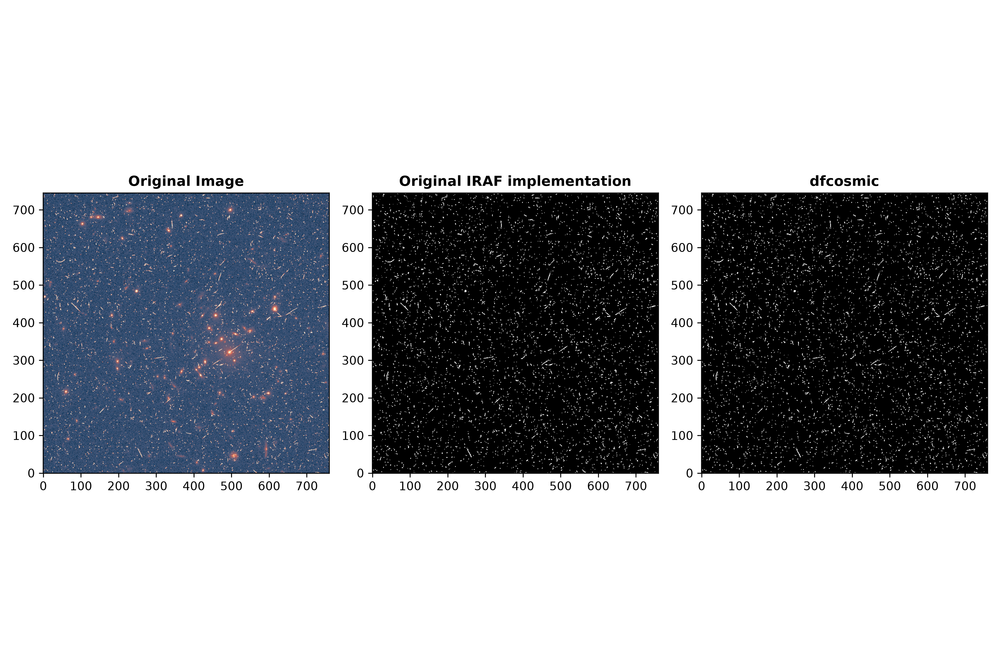

# dfcosmic

[](https://github.com/DragonflyTelescope/dfcosmic/actions/workflows/test.yml) 
[](https://dfcosmic.readthedocs.io/en/latest/?badge=latest)
[](https://doi.org/10.5281/zenodo.18451350)


A high-performance Python package for cosmic ray removal strictly following the procedure outlined in [van Dokkum 2001](https://ui.adsabs.harvard.edu/abs/2001PASP..113.1420V/abstract). Although several other implementations exist, their procedures differ slightly from that described in van Dokkum 2001. In this package, we use [PyTorch](https://pytorch.org/) to achieve considerable speedup over the original implementation while retaining fidelity to the algorithmic choices presented in the original paper.

## Who is dfcosmic for?

`dfcosmic` is for people who want the *original* L.A.Cosmic algorithm, as implemented in the IRAF script `lacos_im.cl`, at pipeline speed. It was written for the nightly reduction pipeline of the MOTHRA array, which has to clean tens of thousands of large CMOS frames every night using two threads per frame. On those data a true median filter turned out to be necessary to remove cosmic rays and hot pixels without also flagging the cores of bright stars.

`dfcosmic` is a good choice if:

- **You need results that match the original algorithm.** `dfcosmic` always uses a true (non-separable) median filter. On the *HST* WFPC2 frame from van Dokkum 2001 its mask agrees with the IRAF mask more closely than the masks of the other codes do (see the [HST notebook](./demos/HST.ipynb)).
- **You need that at scale.** On a 4000 × 6500 image and two threads, the configuration of the MOTHRA pipeline, `dfcosmic` with its [optional C++ median filter](#optional-c-median-filter-for-the-cpu) takes 30 to 40% less time than astroscrappy with a true median filter. On a GPU it takes less than half a second per image (see the [timing comparison](#timing-comparisons)).

[astroscrappy](https://github.com/astropy/astroscrappy) with its default settings (`sepmed=True`) is the better choice if:

- **CPU speed matters more to you than exact agreement with the original algorithm.** Its separable median filter is 1.5 to 4.4 times faster than `dfcosmic` on a CPU, at the cost of a different mask, most visibly in the cores of bright stars.
- **You do not want PyTorch as a dependency**, which is a large install.
- **You need features that `dfcosmic` does not have**, such as input masks, saturation handling or a background/variance image.

## Installation

### Using PyPi

If you want to install using PyPi (which is certainly the easiest way), you can simply run

```bash
pip install dfcosmic
```

### Installing from Source

For the latest development version, install directly from the GitHub repository:

```bash
git clone https://github.com/DragonflyTelescope/dfcosmic.git
cd dfcosmic
pip install -e .
```

Both of these give you a pure-Python install that runs entirely on PyTorch (CPU or GPU). The [example notebooks](#example-notebooks) need a few extra packages, which you can get with `pip install "dfcosmic[notebooks]"`.

For development installation with documentation dependencies:

```bash
pip install -e ".[docs]"
```

### Optional: C++ median filter for the CPU

On the CPU, most of the runtime is spent in the median filter. `dfcosmic` includes an optional C++/OpenMP median filter that gives identical results to the PyTorch one but is faster. It is **not** part of the PyPI wheel and is **not** built by a plain `pip install`, because it has to be compiled against the PyTorch version you have installed. To build it you need a C++ compiler with OpenMP support and PyTorch installed *before* building. On macOS the Xcode command line tools are enough: the extension links against the OpenMP runtime bundled with the PyTorch wheel, so do not point the build at a separate `libomp` (e.g. Homebrew's) via `LDFLAGS` — two OpenMP runtimes in one process will crash.

```bash
pip install torch "setuptools>=77"
git clone https://github.com/DragonflyTelescope/dfcosmic.git
cd dfcosmic
DFCOSMIC_BUILD_CPP=1 pip install --no-build-isolation -e .
```

`--no-build-isolation` is what makes your installed PyTorch visible to the build; `DFCOSMIC_BUILD_CPP=1` turns a missing PyTorch into an error rather than silently skipping the extension. You can check that it worked with

```bash
python -c "from dfcosmic.utils import cpp_median_available; print(cpp_median_available())"
```

Once built, the extension is used automatically when `device="cpu"`. A few things to keep in mind:

- The extension is tied to the PyTorch version it was built against. After upgrading PyTorch, rebuild it by re-running the `pip install` command above.
- If the extension is not available, `dfcosmic` uses the PyTorch median filter. Passing `use_cpp=True` explicitly will warn you (once per session) when that happens; `use_cpp=False` always uses the PyTorch median filter.
- If you want CPU-specific optimizations, you can pass extra compiler flags, e.g. `CXXFLAGS="-march=native"`. The resulting binary will then only run on similar CPUs.
- Setting the environment variable `DFCOSMIC_DISABLE_CPP=1` at runtime disables the extension.

## Basic Usage
We follow the same parameter naming conventions presented in the original IRAF code.

- `objlim`: The contrast limit between CR and underlying objects
- `sigfrac`: The fractional detection limit for neighboring pixels
- `sigclip`: The detection limit for cosmic rays

The following example runs as is on a CPU. It uses a synthetic image; replace it with your own 2D image, for example from `astropy.io.fits.getdata`.

```python
import numpy as np
from dfcosmic import lacosmic

# Synthetic sky frame with 50 cosmic ray hits
rng = np.random.default_rng(0)
image = rng.normal(200, 15, (512, 512)).astype(np.float32)
image[rng.integers(0, 512, 50), rng.integers(0, 512, 50)] += 2000

clean_image, crmask = lacosmic(
    image,
    sigclip=4.5,
    sigfrac=0.5,
    objlim=1,
    gain=1,
    readnoise=5,
    niter=1,
    device="cpu",
)
print(f"{crmask.sum()} pixels flagged")
```

`lacosmic` returns the cleaned image and a boolean mask of the flagged pixels.

### Running on a GPU

Set `device="cuda"` to run on an NVIDIA GPU, or `device="mps"` on Apple Silicon. This requires a PyTorch build with support for that device; asking for a device that is not available raises an error. You can check with `torch.cuda.is_available()` or `torch.backends.mps.is_available()`.

### Gain and read noise

If you do not know the gain you can leave it out or set it to 0. It is then estimated from the image at every iteration, as in the original IRAF script, assuming that the noise is dominated by the sky background.

This estimate needs the sky background to still be in the image. For background-subtracted frames it fails with `Gain determination failed` (or gives a meaningless value), so for those you have to provide the gain. The `skyval` and `statsec` parameters of the IRAF script are not implemented.

If you know the gain, providing it is also faster, since the estimate costs an additional median filter per iteration.

### Input images

- `image` must be a 2D numpy array or torch tensor. Numpy arrays of any dtype, byte order and memory layout are accepted, so data straight from `astropy.io.fits.getdata` works without conversion. The input is never modified.
- All computations are done in single precision: the cleaned image is returned as `float32`, even for `float64` input.
- Non-finite pixels (NaN and ±inf, e.g. flagged bad pixels) are ignored: they are excluded from the gain estimate, are never flagged as cosmic rays, and are returned unchanged in the cleaned image.

## Memory-Constrained CPU Runners

On small CPU runners, PyTorch CPU convolutions can request a large temporary workspace. `dfcosmic` supports two environment variables to force safer behavior:

```bash
export DFCOSMIC_CONVOLVE_DIRECT_MAX_NUMEL=0
export DFCOSMIC_MAX_MEMORY_MB=2048
```

- `DFCOSMIC_CONVOLVE_DIRECT_MAX_NUMEL=0` forces CPU convolution onto the chunked path.
- `DFCOSMIC_MAX_MEMORY_MB=2048` reduces chunk sizes in the main memory-heavy CPU steps to fit a rough 2 GB workspace budget.

For the tightest runners, also set `cpu_threads=1` when calling `lacosmic(...)`.

### Median filters only where they are needed

Three of the five median filters in an iteration are only read at a few pixels (the candidate and the flagged pixels), so `dfcosmic` evaluates them at those pixels only. The result is exactly the same as filtering the whole image. If those pixels make up more than 10% of the image, `dfcosmic` filters the whole image instead; the fraction can be changed with the environment variable `DFCOSMIC_SPARSE_MEDIAN_MAX_FRACTION`, and `0` always filters the whole image.

### Limiting CPU threads

`cpu_threads` limits the number of CPU threads for the duration of the call only. The thread settings of PyTorch and of the other OpenMP/BLAS thread pools in the process are restored when `lacosmic` returns, and no environment variables are changed, so the rest of your program is not affected. If `cpu_threads` is not given, `lacosmic` uses whatever the process is already configured to use (e.g. `torch.get_num_threads()`).

## Simple Example



## Timing Comparisons

We compare `dfcosmic` on a CPU as installed from PyPI (PyTorch only), on a CPU with the [optional C++ median filter](#optional-c-median-filter-for-the-cpu) and on a GPU with two popular cosmic ray removal codes: [astroscrappy](https://github.com/astropy/astroscrappy) and [lacosmic](https://github.com/larrybradley/lacosmic).

The comparison is like-for-like. Every code gets the same image and the same parameters, and runs one iteration (`niter=1`). Each configuration is timed in its own process: one warm-up call, then three timed calls, in five separate processes. The image is the synthetic frame of the [astroscrappy testing suite](https://github.com/astropy/astroscrappy/blob/main/astroscrappy/tests/fake_data.py), enlarged to 4000 × 6500 pixels, the size of a MOTHRA frame.


*Runtime per 4000 × 6500 image against the number of CPU threads, with  and the same parameters in every code. Each point is the median of 15 timed calls; their range, at most 12% of the median, is smaller than the markers.*

Median runtime in seconds over the 15 timed calls, with the minimum and maximum in brackets:

| Configuration | 1 thread | 2 threads | 4 threads | 8 threads | 16 threads |
|---|---:|---:|---:|---:|---:|
| dfcosmic · CPU, PyTorch only | 19.2 (18.7–19.6) | 10.6 (10.3–10.9) | 6.22 (6.03–6.51) | 4.23 (3.90–4.40) | 3.28 (3.08–3.41) |
| dfcosmic · CPU, C++ median filter | 15.3 (15.1–15.4) | 8.47 (8.33–8.58) | 4.79 (4.70–4.88) | 2.99 (2.90–3.19) | 2.18 (2.13–2.25) |
| dfcosmic · GPU | 0.330 (0.328–0.335) | – | – | – | 0.329 (0.328–0.332) |
| astroscrappy · true median (sepmed=False) | 27.1 (26.9–27.7) | 14.2 (14.1–14.6) | 7.66 (7.63–7.75) | 4.43 (4.39–4.47) | 2.84 (2.81–2.95) |
| astroscrappy · separable median (sepmed=True) | 8.03 (7.93–8.20) | 4.61 (4.49–4.66) | 2.80 (2.76–2.87) | 1.93 (1.90–1.95) | 1.49 (1.47–1.51) |
| lacosmic (single-threaded) | 24.9 (24.8–25.5) | – | – | – | 24.9 (24.7–25.1) |

Measured with `dfcosmic` 0.2.0, `astroscrappy` 1.3.0, `lacosmic` 1.4.0 and PyTorch 2.14.1 on an AMD Ryzen 9 9950X (16 cores, 32 threads) and NVIDIA GeForce RTX 5060 Ti (16 GB).

What the measurement shows:

- **Against the other true-median codes**, `dfcosmic` with the C++ median filter is the fastest at every number of threads. It takes 44% less time than astroscrappy on one thread, 40% less on two and 23% less on 16.
- **As installed from PyPI** (PyTorch only), `dfcosmic` is faster than astroscrappy with a true median filter on one to four threads, about level on eight, and 16% slower on 16.
- **On the GPU** an image takes 0.33 s.
- **astroscrappy's default** (`sepmed=True`) is 1.5 to 1.9 times faster than `dfcosmic` on the CPU. It uses a separable median filter, which is a different algorithm and gives a different mask.
- **The image matters.** `dfcosmic` evaluates three of its five median filters only at the candidate and flagged pixels, and this image has only 100 cosmic rays. On a crowded image (the *HST* frame of the example above repeated to the same size, where 3% of the pixels are cosmic rays), `dfcosmic` with the C++ median filter takes 34% less time than astroscrappy with a true median filter on one thread, 30% less on two, and the same time on 16. On the GPU that image takes 0.44 s.

[demos/Comparison.ipynb](./demos/Comparison.ipynb) has the full tables for the crowded image and for `niter=4`, the comparison with `dfcosmic` 0.1.0, and the checks that every code kept to its thread limit. You can repeat the measurement on your own machine with [demos/benchmark.py](./demos/benchmark.py).

## Example Notebooks

The notebooks in [demos/](./demos) are also rendered in the [documentation](https://dfcosmic.readthedocs.io):

- [QuickExample.ipynb](./demos/QuickExample.ipynb): cleaning the *HST* WFPC2 frame from van Dokkum 2001 and comparing the mask with the one from IRAF.
- [HST.ipynb](./demos/HST.ipynb): the same frame cleaned with `dfcosmic`, `astroscrappy` and `lacosmic`, and how closely each mask agrees with the one from IRAF.
- [Comparison.ipynb](./demos/Comparison.ipynb): the timing comparison shown above. It displays the results measured by [benchmark.py](./demos/benchmark.py).

The notebooks need a few packages that `dfcosmic` itself does not depend on: `astropy`, `matplotlib` and `cmcrameri` for all of them, and `astroscrappy` and `lacosmic` (version 1.4 or later, which needs Python 3.11) for the two comparison notebooks. You can install all of them with

```bash
pip install "dfcosmic[notebooks]"
```


## Running Tests
The unit tests can be run using the following command:

```bash
pytest
```

The default settings are in the `[tool.pytest.ini_options]` section of `pyproject.toml`. The tests for the C++ median filter are skipped unless the extension has been built.

## Contributing

Contributions are welcome! [CONTRIBUTING.md](CONTRIBUTING.md) explains how to set up a development environment, run the tests and the linter, and build the documentation. Changes between releases are listed in [CHANGELOG.md](CHANGELOG.md).

## Citation
If you use this package, please include a reference to the GitHub repository and the following Zenodo DOI: 10.5281/zenodo.18451351. Citation metadata is also available in [CITATION.cff](CITATION.cff) (the "Cite this repository" button on GitHub).


## License
The License for all past and present versions is the GPL-3.0.

## AI Disclosure
Generative AI was used for the following parts of this project:

1. Claude (Claude.ai and Claude Code) was used to help write the unit tests and to understand the original IRAF implementation.
2. ChatGPT/Codex was used to write the C++ median filter and to make the code more memory efficient.
3. Claude Code was used to help implement the changes requested during the pyOpenSci review: packaging and continuous integration, input validation, the handling of non-finite and unrepairable pixels, the per-iteration gain estimate, the timing benchmark, and documentation.

The original implementation of the algorithm was written by the authors without AI. All code produced by AI was manually inspected for correctness.
