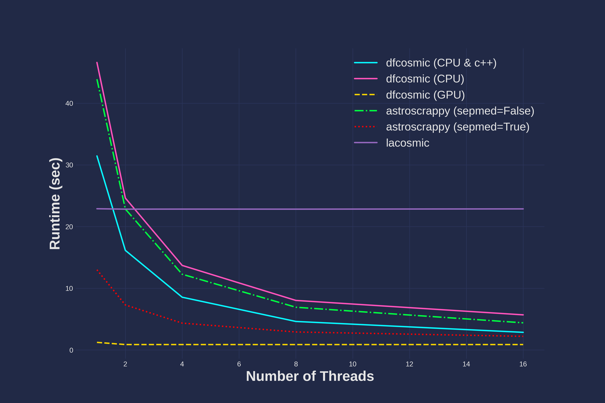

.. dfcosmic documentation master file, created by
   sphinx-quickstart on Wed Dec  3 20:37:05 2025.
   You can adapt this file completely to your liking, but it should at least
   contain the root `toctree` directive.

dfcosmic documentation
======================

.. image:: https://zenodo.org/badge/1109261439.svg
  :target: https://doi.org/10.5281/zenodo.18451350

Welcome to the documentation for *dfcosmic* -- a PyTorch implementation of the LA Cosmic algorithm by `van Dokkum 2001 <https://ui.adsabs.harvard.edu/abs/2001PASP..113.1420V/abstract>`_.

Who is dfcosmic for?
--------------------

*dfcosmic* is for people who want the *original* L.A.Cosmic algorithm, as implemented
in the IRAF script ``lacos_im.cl``, at pipeline speed. It was written for the nightly
reduction pipeline of the MOTHRA array, which has to clean tens of thousands of large
CMOS frames every night using two threads per frame. On those data a true median
filter turned out to be necessary to remove cosmic rays and hot pixels without also
flagging the cores of bright stars.

*dfcosmic* is a good choice if:

- **You need results that match the original algorithm.** *dfcosmic* always uses a
  true (non-separable) median filter. On the *HST* WFPC2 frame from van Dokkum 2001
  its mask agrees with the IRAF mask more closely than the masks of the other codes
  do (see the HST example).
- **You need that at scale.** On a 4000 × 6500 image and two threads, the
  configuration of the MOTHRA pipeline, *dfcosmic* with its optional C++ median filter
  takes 30 to 40% less time than astroscrappy with a true median filter. On a GPU it
  takes less than half a second per image (see the timing analysis below).

`astroscrappy <https://github.com/astropy/astroscrappy>`_ with its default settings
(``sepmed=True``) is the better choice if:

- **CPU speed matters more to you than exact agreement with the original
  algorithm.** Its separable median filter is 1.5 to 4.4 times faster than
  *dfcosmic* on a CPU, at the cost of a different mask, most visibly in the cores of bright
  stars.
- **You do not want PyTorch as a dependency**, which is a large install.
- **You need features that dfcosmic does not have**, such as input masks, saturation
  handling or a background/variance image.

Quick start
-----------

Install with ``pip install dfcosmic`` (see :doc:`installation`). The following example
runs as is on a CPU. It uses a synthetic image; replace it with your own 2D image, for
example from ``astropy.io.fits.getdata``.

.. code:: python

    import numpy as np
    from dfcosmic import lacosmic

    # Synthetic sky frame with 50 cosmic ray hits
    rng = np.random.default_rng(0)
    image = rng.normal(200, 15, (512, 512)).astype(np.float32)
    image[rng.integers(0, 512, 50), rng.integers(0, 512, 50)] += 2000

    clean_image, crmask = lacosmic(
        image,
        sigclip=4.5,
        sigfrac=0.5,
        objlim=1,
        gain=1,
        readnoise=5,
        niter=1,
        device="cpu",
    )
    print(f"{crmask.sum()} pixels flagged")

``lacosmic`` returns the cleaned image and a boolean mask of the flagged pixels. To
run on a GPU, set ``device="cuda"`` (NVIDIA) or ``device="mps"`` (Apple Silicon); this
requires a PyTorch build with support for that device.

Runtime Options
---------------
There are three runtime options. We list them below in order of speed from the slowest to the fastest implementation:

1. CPU pure PyTorch: this implementation uses only PyTorch for all functions. This is what you get on the CPU after ``pip install dfcosmic``. It can be forced by adding the argument `use_cpp=False`.

2. CPU Pytorch & C++: this implementation uses Pytorch combined with the median filter implemented in C++ for speed optimizations. The C++ median filter is optional and has to be built from source (see :doc:`csrc`); once built, it is used automatically when `device='cpu'`. Passing `use_cpp=True` emits a warning if it is not available.

3. GPU: this implementation uses PyTorch only and runs on the GPU. This runs when `device='cuda'` (or `device='mps'` on Apple Silicon) is set.

Main Parameters
---------------
There are several key parameters that a user can set depending on their specific use case:

1. `objlim`: the contrast limit between cosmic rays and underlying objects

2. `sigfrac`: the fractional detection limit for neighboring pixels

3. `sigclip`: the detection limit for cosmic rays

Furthermore, the user can supply the gain and readnoise. If a gain is not supplied, then it will be estimated at each iteration, as in the original IRAF script. This estimate assumes that the sky background is still in the image: for background-subtracted frames it fails (or gives a meaningless value), so the gain has to be supplied for those.

Additional parameters can be found in the API call to `lacosmic`.

Timing Analysis
---------------

**Timing analysis** of *dfcosmic* versus *astroscrappy* and *lacosmic*: runtime per
4000 × 6500 image against the number of CPU threads. Every code gets the same image
and parameters and runs one iteration (``niter=1``); each point is the median of 15
timed calls, made in five separate processes after a warm-up call. The range of the
calls, at most 12% of the median, is smaller than the markers. Measured with
*dfcosmic* 0.2.0, *astroscrappy* 1.3.0, *lacosmic* 1.4.0 and PyTorch 2.14.1 on an
AMD Ryzen 9 9950X (16 cores, 32 threads) and NVIDIA GeForce RTX 5060 Ti (16 GB).

- Against the other true-median codes, *dfcosmic* with the C++ median filter is the
  fastest at every number of threads: it takes 44% less time than astroscrappy with
  ``sepmed=False`` on one thread, 40% less on two and 23% less on 16.
- As installed from PyPI (PyTorch only), *dfcosmic* is faster than astroscrappy with a
  true median filter on one to four threads, about level on eight, and 16% slower on
  16.
- On the GPU an image takes 0.33 s.
- astroscrappy's default (``sepmed=True``) is 1.5 to 1.9 times faster than *dfcosmic*
  on the CPU. It uses a separable median filter, which is a different algorithm and
  gives a different mask.
- This image has only 100 cosmic rays, and the runtime of *dfcosmic* depends on their
  number. On a crowded image, where 3% of the pixels are cosmic rays, *dfcosmic* with
  the C++ median filter takes 34% less time than astroscrappy with a true median
  filter on one thread, 30% less on two, and the same time on 16.

The :doc:`timing comparison notebook <demos/Comparison>` has all the numbers, the
crowded image, ``niter=4`` and the checks that were made; ``demos/benchmark.py`` in the
repository repeats the measurement on your own machine.

.. toctree::
   :maxdepth: 1
   :caption: Getting started:

   installation

.. toctree::
   :maxdepth: 1
   :caption: Examples:

   demos/QuickExample.ipynb
   demos/Comparison.ipynb
   demos/HST.ipynb

.. toctree::
    :maxdepth: 2
    :caption: API:

    autoapi/index
    csrc

.. toctree::
    :maxdepth: 1
    :caption: Development:

    contributing
    changelog
