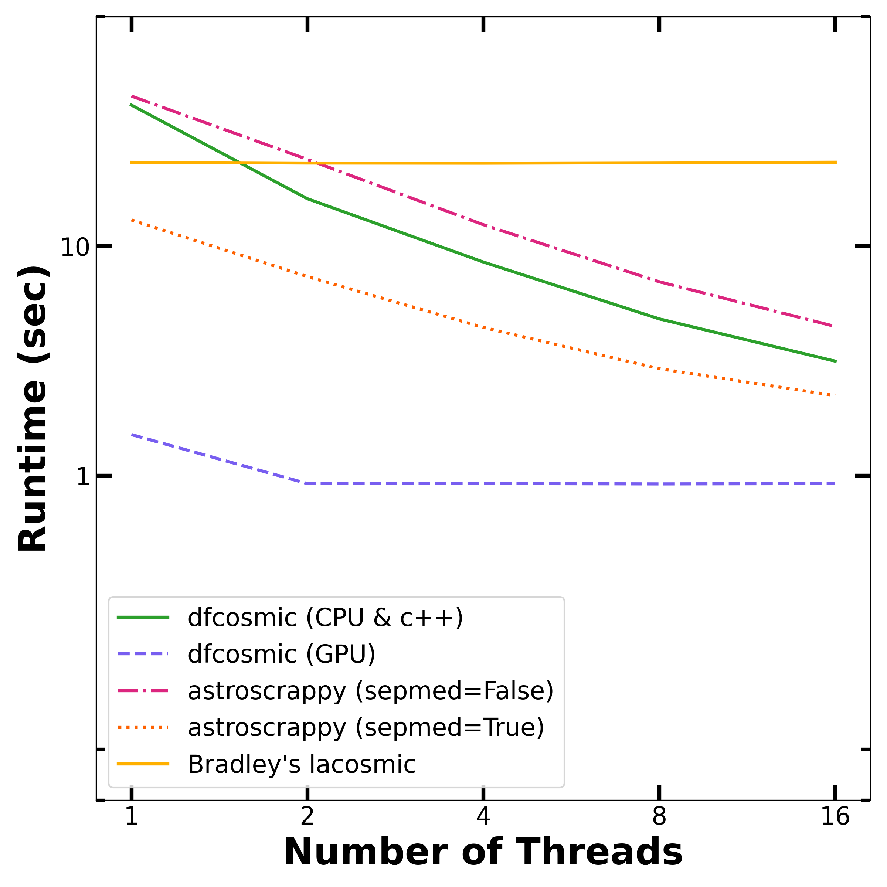

# Summary
Astronomical images are far from pristine despite the best efforts of observers; they can include streaks from Earth-orbit satellites or pixel-sized inclusions from cosmic rays (CR); CRs are high-energy charged particles moving near the speed of light. A key step in the processing of astronomical images is the removal of these CRs. `dfcosmic` is a Python package utilizing PyTorch and native C++ code to optimize the detection of CRs on both the CPU and GPU in order to rapidly and reliably detect and remove CRs from raw astronomical images. 

# Statement of need
Although several implementations of L.A.Cosmic [@van_dokkum_cosmic-ray_2001] exist such as `lacosmic` [@bradley_larrybradleylacosmic_2025] and `astroscrappy` [@robitaille_astropyastroscrappy_2025], these implementations either deviate from the original algorithm in order to achieve computational gains or do not run fast enough for practical usage. In particular, the data reduction pipeline for the Modular Optical Telephoto Hyperspectral Robotic Array (MOTHRA) requires rapid cosmic ray identification and removal for tens of thousands of images every night using only a single core (2 threads) per frame. Importantly, experiments on the preliminary data taken by MOTHRA have demonstrated that it is crucial to use the original implementation (notably a true median filter rather than a separable median filter) in order to capture all the cosmic rays without accidentally removing bright stars. `dfcosmic` has already been adopted in the nightly reduction pipeline for MOTHRA.

# State of the field
There currently exist other cosmic ray removal codes in Python based on the L.A.Cosmic [@van_dokkum_cosmic-ray_2001] algorithm; notably  `lacosmic` [@bradley_larrybradleylacosmic_2025] and `astroscrappy` [@robitaille_astropyastroscrappy_2025]. The nightly reduction of MOTHRA requires running L.A.Cosmic on tens of thousands of frames every day; therefore, it is necessary to have a fast, and reliable, implementation of the algorithm to reduce all the data in a reasonable amount of time. Moreover, although the current data reduction infrastructure only supports CPU computing, we wish to have a package that will eventually be able to run rapidly on a GPU. 

In light of these considerations, we have developed `dfcosmic`. In order to demonstrate the speed benefits of using `dfcosmic`, we benchmark it against the `astroscrappy` and `lacosmic` implementations. Notably, `astroscrappy`'s default run configuration uses a separable median filter which is a non-negligible departure from the original algorithm in order to speed up the algorithm. We run `astroscrappy` in our benchmarking with and without the separable median filter active. We stress that the use of a separable median filter *can* result in the incorrect removal of cosmic rays by incorrectly classifying the center of near-saturated or saturated stars as cosmic rays. We show the results of the three different versions of `dfcosmic`: CPU with torch only, CPU with C++ optimization, and GPU. We discuss these three different versions in the software design section of this paper.

We run the codes on the mock data used for testing by [`astroscrappy`](https://github.com/astropy/astroscrappy/blob/main/astroscrappy/tests/fake_data.py) with a typically sized frame for MOTHRA (4000x6500). Each option was run employing 1, 2, 4, 8, and 16 threads.
The GPU used in this test was an NVIDIA GeForce RTX 5060 Ti 16GB while the CPU was an AMD Ryzen 9 9950X 16-Core Processor.

Although the performance gain with 2 or more threads may seem small compared with the overall runtime, even a minimal gain for each individual frame corresponds to a considerable gain when running the pipeline on several tens of thousands of frames nightly. 

# Software design
`dfcosmic` was designed to be a simple PyTorch implementation of the cosmic ray reduction algorithm initially developed in [@van_dokkum_cosmic-ray_2001]. 
The code was complexified in order to achieve greater reductions in speed. Notably, initial benchmarking revealed the dilation and median filter algorithms to be considerable bottlenecks. Therefore, we adopted C++ implementations of both of these algorithms. Doing so allowed `dfcosmic` to be competitive (and even outperform) existing implementations when run on 2 or more threads. We chose to use PyTorch instead of a more standard library, such as numpy or scipy, so that we could take advantage of the GPU, if available. As demonstrated in Figure \autoref{fig:comparison}, the GPU implementation is more than an order of magnitude faster than any other implementation. Although not explored here, the GPU implementation also allows for batch processing which can enable further speedup. 

In order to ensure the fidelity of the functions run internally, we wrote custom torch implementations of the following: `block_replicate_torch`, `convolve`, `median_filter_torch`, `dilation_pytorch`, `sigma_clip_pytorch`. In case a user is unable to enable C++, we allow the code to default to the custom torch implementations of the median filter and dilation algorithms; we note that this leads to a worse performance as compared to the C++ implementations.

# Research impact statement
`dfcosmic` is a new implementation of the well-known L.A.Cosmic algorithm developed by [@van_dokkum_cosmic-ray_2001]. Although only recently released for public use, `dfcosmic` has already been integrated into the nightly reduction pipeline for the partially-constructed MOTHRA. The adoption of this algorithm has considerable impact on the speed of reductions. During a typical night, a single MOTHRA array takes approximately 1200 raw frames (this is the low end); note that the final version of MOTHRA will have 30 arrays operating simultaneously. On the existing computing infrastructure on AWS, the reduction of a frame using `astroscrappy(sepmed=False)` using 2 threads per frame takes approximately 75 seconds; using `dfcosmic` with the same setup takes approximately 55 seconds. When run on all the frames taken in an evening, this is equivalent to saving 24,200 seconds (6.7 hours) of computing time for a single array. 

# Methods

## Algorithm

The algorithm follows the methodology described in detail in [@van_dokkum_cosmic-ray_2001]. Below, we outline the main steps:

1. Run laplacian detection
2. Create a noise model
3. Create significance map
4. Compute initial cosmic ray candidates
5. Reject objects (i.e. stars or HII regions)
6. Determine which neighboring pixels to include
7. Replace confirmed cosmic rays with median of neighbors

Importantly, we use the classic median filter rather than any optimized version. We overcome the additional computational costs associated with this computation by implementing our methodology in `PyTorch` [@paszke_pytorch_2019] with certain functions (the median filter and dilation) written in C++.

## Main parameters
There are several key parameters that a user can set depending on their specific use case:

1. `objlim`: the contrast limit between cosmic rays and underlying objects
2. `sigfrac`: the fractional detection limit for neighboring pixels
3. `sigclip`: the detection limit for cosmic rays

Furthermore, the user can supply the gain and readnoise. If a gain is not supplied, then it will be estimated at each iteration.

# Results

## Example
In order to showcase `dfcosmic`, we construct an example image that is 100x100 pixels containing two fake elliptical galaxies and 10 stars with Gaussian noise. We then add 10 cosmic rays. We subsequently run `dfcosmic` with the default parameters. In the image below (\autoref{fig:demo}), we show the clean mock image, the cosmic ray mask, the dirty mock image (clean mock image + cosmic rays), the `dfcosmic` image, and the `dfcosmic` mask. We see that the algorithm correctly detects all cosmic rays in the image; additionally, it incorrectly marks two noisy pixels at the boundary as cosmic rays. This is a known complication with the algorithm. However, these noisy pixels are replaced with a median of their neighboring pixels and thus do not change the noise properties of the image.

# AI usage disclosure
Generative AI was used for two aspects of this project:

1. Claude.ai was used to help write/augment the unit tests

2. ChatGPT was used to write the C++ code for the dilation and median filter functions

All code produced by AI was manually inspected for correctness.

The core functionality was not influenced by AI.

# Acknowledgements
We acknowledge the Dragonfly FRO and particularly thank Lisa Sloan for her project management skills.

We use the cmcrameri scientific color maps in our demos [@crameri_scientific_2023].

# References
